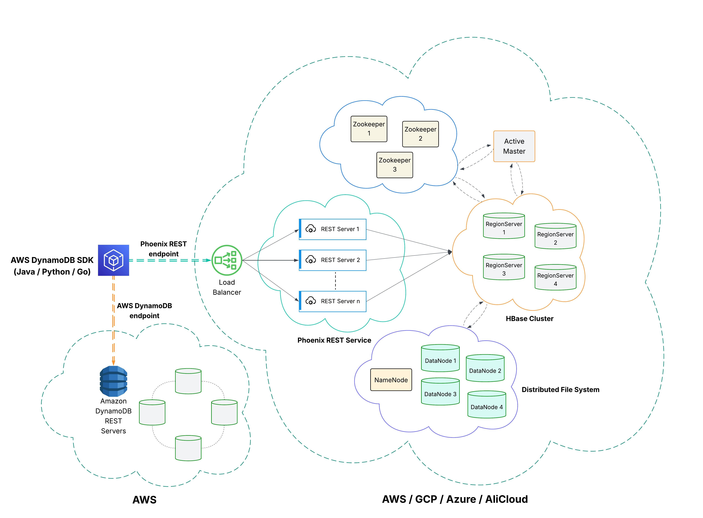

# 🔄 Phoenix-Shim: A Unified NoSQL Frontend for Apache Phoenix


A frontend layer that mimics NoSQL APIs for different databases while always using **Salesforce Phoenix** (on HBase) as the persistent store.

### Building Distribution Tarball

To build a distribution tarball that includes all components:

```
mvn clean package
```

This will generate a tarball in `phoenix-ddb-assembly/target/phoenix-shim-*-bin.tar.gz`

## Installation

1. Extract the distribution tarball:
```bash
tar xzf phoenix-shim-<version>-bin.tar.gz
cd phoenix-shim-<version>
```

2. Configure the environment variables in `conf/phoenix-shim-env.sh`:
```bash
export JAVA_HOME=/path/to/java
export PHOENIX_SHIM_HOME=/path/to/extracted/phoenix-shim
```

## Configuration

### Environment Variables

The following environment variables can be configured:

- `JAVA_HOME`: Path to Java installation
- `PHOENIX_SHIM_HOME`: Path to Phoenix Shim installation
- `PHOENIX_SHIM_CONF_DIR`: Configuration directory (default: $PHOENIX_SHIM_HOME/conf)
- `PHOENIX_SHIM_LOG_DIR`: Log directory (default: $PHOENIX_SHIM_HOME/logs)
- `PHOENIX_SHIM_PID_DIR`: PID directory (default: /var/run/phoenix-shim)
- `PHOENIX_REST_HEAPSIZE`: Maximum heap size (e.g., "2g")
- `PHOENIX_REST_OFFHEAPSIZE`: Maximum off-heap memory size (e.g., "1g")
- `PHOENIX_REST_OPTS`: Additional JVM options
- `PHOENIX_DDB_REST_OPTS`: Additional JVM options for REST server

### Logging Configuration

Logging can be configured in `conf/log4j.properties`. The default configuration includes:
- Console logging
- File logging with rotation
- GC logging
- Heap dumps on OutOfMemoryError

## Running the Server

### Starting the Server

To start the REST server as a daemon:

```bash
bin/phoenix-shim.sh start rest
```

To start in foreground mode (for debugging):

```bash
bin/phoenix-shim.sh rest
```

### Checking Server Status

To check if the server is running:

```bash
bin/phoenix-shim.sh status rest
```

### Stopping the Server

To stop the server:

```bash
bin/phoenix-shim.sh stop rest
```

### Restarting the Server

To restart the server:

```bash
bin/phoenix-shim.sh restart rest
```

## Logs

Logs are stored in the following locations:
- Main log: `$PHOENIX_SHIM_LOG_DIR/rest.log`
- GC log: `$PHOENIX_SHIM_LOG_DIR/gc.log`
- Heap dumps: `$PHOENIX_SHIM_LOG_DIR/` (on OutOfMemoryError)


## 📖 Overview
It can be challenging for Salesforce applications/services to maintain different codebases for different substrates if they use the substrate-native NoSQL database. These databases also do not have built-in SOR or Org Migration support.

This is where Phoenix-Shim comes in. It allows developers to write new services (or port their existing services with minimal code changes) using familiar NoSQL semantics while leveraging the scalability and SOR-ness of *Salesforce Phoenix*. 

Salesforce Phoenix, the combined solution of Apache HBase and Apache Phoenix, supported with significant additional tooling for meeting **Salesforce System of Record** requirements, is a horizontally scalable relational but non-transactional datastore, operating in both 1P and Hyperforce.

## 🧩 Supported Frontends

### DynamoDB
There are 2 ways someone can use Phoenix-Shim to port their DynamoDB based service to Salesforce Phoenix:
1. **Java thick client** which translates API calls into Phoenix SQL
    - [PhoenixDBClientV2](https://git.soma.salesforce.com/bigdata-packaging/phoenix-shim/blob/master/phoenix-ddb-shim/src/main/java/org/apache/phoenix/ddb/PhoenixDBClientV2.java) and [PhoenixDBStreamsClientV2](https://git.soma.salesforce.com/bigdata-packaging/phoenix-shim/blob/master/phoenix-ddb-shim/src/main/java/org/apache/phoenix/ddb/PhoenixDBStreamsClientV2.java) implement DynamoDB's Client SDK V2.

2. A **RESTful API Server** that accepts JSON payloads similar to DynamoDB.

By using REST Service, client applications already using any AWS SDKs to connect with DynamoDB
does not need to perform any code change. The client application only needs to update the REST
endpoint.



#### Supported APIs
- **DDL**: CreateTable, DeleteTable, ListTables, DescribeTable, UpdateTimeToLive, DescribeTimeToLive
- **DQL**: Query, Scan, BatchGetItem
- **DML**: PutItem, UpdateItem, BatchWriteItem, DeleteItem
- **Change Data Capture**: ListStreams, DescribeStreams, GetShardIterator, GetRecords

### MongoDB
TBD

### How to bring up REST Server in dev env?

1. Bring up HBase cluster locally. Refer to https://hbase.apache.org/book.html#quickstart
2. Bring up Phoenix system tables using sqlline (bin/sqlline.py). Refer to https://phoenix.apache.org/installation.html.
2. Clone phoenix-shim repo.
2. Build the project with: `mvn clean install -DskipTests`
3. Start the REST Server with: `bin/phoenix-shim rest start -p <port> -z <zk-quorum>`
   e.g. `bin/phoenix-shim rest start -p 8842 -z localhost:2181` to start the server at
   port 8842 with zk-quorum localhost:2181.
   Alternative to `-z <zk-quorum>` is env variable `ZOO_KEEPER_QUORUM`.
4. Optional step: To confirm the server is started and functional,
   run class `TestWithLocalRestService` by adjusting the endpoint.

