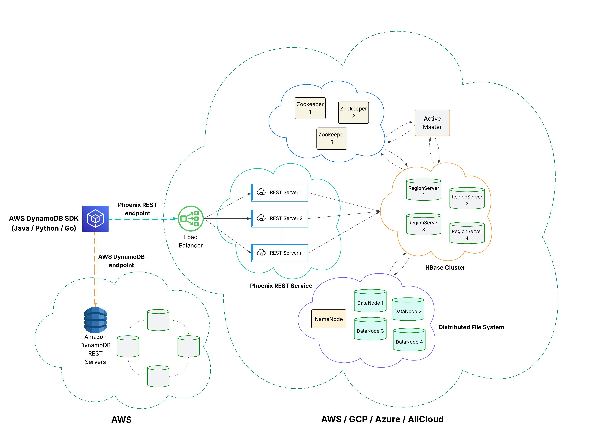

# 🔄 Phoenix-Adapters: NoSQL Database Adapters using Apache Phoenix

Phoenix-Adapters provides adapters for various NoSQL databases (e.g., DynamoDB) backed by **Apache Phoenix** (on HBase) as the persistent store.


## 📖 Overview
It can be challenging for applications/services to maintain different codebases for different substrates/cloud providers if they use the substrate-native NoSQL databases.

This is where Phoenix-Adapters comes in. It allows developers to write new services (or port their existing services with minimal code changes) using familiar NoSQL semantics while leveraging the scalability, fault-tolerance and predictable performance of *Apache Phoenix/HBase*.

## 🧩 Supported Database Adapters

### DynamoDB
How to use Phoenix-Adapters to port their DynamoDB based service to Apache Phoenix?

- A **RESTful API Server** that accepts JSON payloads similar to DynamoDB.

By using REST Service, client applications already using any AWS SDKs to connect with DynamoDB
does not need to perform any code change. The client application only needs to update the REST
endpoint.

> **Production-ready and horizontally scalable.** The REST process is 100% stateless — all state lives in the underlying HBase cluster. Spawn as many instances (containers / VMs / pods) as you need and put any load balancer in front of them; no session affinity, no inter-instance coordination required.



#### Supported DynamoDB APIs
- **DDL**:
    - CreateTable
    - DeleteTable
    - DescribeTable
    - ListTables
    - UpdateTable
    - UpdateTimeToLive
    - DescribeTimeToLive
- **DQL**:
    - Query
    - Scan
    - BatchGetItem
    - GetItem
- **DML**:
    - PutItem
    - UpdateItem
    - BatchWriteItem
    - DeleteItem
- **Change Stream**:
    - ListStreams
    - DescribeStream
    - GetShardIterator
    - GetRecords

**For detailed project overview and API reference (including request/response parameters, validations, and examples), see the [DynamoDB API Reference](DDB_API_REFERENCE.md)**

### Connecting with AWS SDK

The Phoenix DynamoDB REST service is fully compatible with AWS SDKs. You can connect to it by simply configuring the endpoint URL to point to your Phoenix REST service instead of the standard DynamoDB endpoint.

📖 **For detailed examples and configuration instructions, see the [Phoenix DynamoDB REST Service README](phoenix-ddb-rest/README.md)**

### How to bring up REST Server in dev env?

1. Bring up HBase cluster locally. Refer to https://hbase.apache.org/book.html#quickstart
2. Bring up Phoenix system tables using sqlline (bin/sqlline.py). Refer to https://phoenix.apache.org/installation.html.
3. Clone phoenix-adapters repo.
4. Build the project with: `mvn clean install -DskipTests`
5. Start the REST Server with: `bin/phoenix-adapters rest start -p <port> -z <zk-quorum>`
   e.g. `bin/phoenix-adapters rest start -p 8842 -z localhost:2181` to start the server at
   port 8842 with zk-quorum localhost:2181.
   Alternative to `-z <zk-quorum>` is env variable `ZOO_KEEPER_QUORUM`.

#### One-shot Docker setup (recommended for first-time users)

Skip steps 1-2 above with the bundled Docker cluster. From a fresh clone:

**Prerequisites:** Docker Desktop running; `jq` and `curl` on `PATH`
(`brew install jq` on macOS).

```bash
# 1. Bring up the full stack at the versions pinned in pom.xml and BLOCK
#    until every container reports healthy (REST is ~30-60s on cold start).
#    First time: ~8-12 min total -- most of that is Maven downloading
#    ~1.5 GB of dependencies into the BuildKit cache mount. Subsequent
#    runs reuse the cache and rebuild in seconds.
docker compose -f docker/docker-compose.yml up -d --build --wait

# 2. Validate it works end-to-end (CRUD + UpdateItem + BatchWriteItem + streams).
bash docker/scripts/smoke.sh
# -> "Result: 21 checks PASSED across 18 API calls"

# 3. Use it. The DynamoDB-compatible endpoint is at http://localhost:8842 .
#    Point any AWS SDK at it (Java/Python/Node.js snippets in
#    phoenix-ddb-rest/README.md), or hit it with curl:
curl -s -X POST http://localhost:8842/ \
    -H 'Content-Type: application/x-amz-json-1.0' \
    -H 'X-Amz-Target: DynamoDB_20120810.ListTables' -d '{}'

# 4. Tear down when you're done.
docker compose -f docker/docker-compose.yml down -v
```

See [`docker/README.md`](docker/README.md) for the full reference: port
mappings, the developer inner loop for code changes, the smoke-test
breakdown, troubleshooting, and how to run the REST server outside
Docker against the dockerized cluster.

### Building Distribution Tarball

To build a distribution tarball that includes all components:

```
mvn clean package
```

This will generate a tarball in `phoenix-ddb-assembly/target/phoenix-adapters-*-bin.tar.gz`

## Installation

1. Extract the distribution tarball:
```bash
tar xzf phoenix-adapters-<version>-bin.tar.gz
cd phoenix-adapters-<version>
```

2. Configure the environment variables in `conf/phoenix-adapters-env.sh`:
```bash
export JAVA_HOME=/path/to/java
export PHOENIX_ADAPTERS_HOME=/path/to/extracted/phoenix-adapters
```

## Configuration

### Environment Variables

The following environment variables can be configured:

- `JAVA_HOME`: Path to Java installation
- `PHOENIX_ADAPTERS_HOME`: Path to Phoenix Adapters installation
- `PHOENIX_ADAPTERS_CONF_DIR`: Configuration directory (default: $PHOENIX_ADAPTERS_HOME/conf)
- `PHOENIX_ADAPTERS_LOG_DIR`: Log directory (default: $PHOENIX_ADAPTERS_HOME/logs)
- `PHOENIX_ADAPTERS_PID_DIR`: PID directory (default: /var/run/phoenix-adapters)
- `PHOENIX_REST_HEAPSIZE`: Maximum heap size (e.g., "2g")
- `PHOENIX_REST_OFFHEAPSIZE`: Maximum off-heap memory size (e.g., "1g")
- `PHOENIX_REST_OPTS`: Additional JVM options
- `PHOENIX_DDB_REST_OPTS`: Additional JVM options for REST server

### Logging Configuration

Logging can be configured in `conf/log4j.properties`. The default configuration includes:
- Console logging
- File logging with rotation
- GC logging
- Heap dumps on OutOfMemoryError

## Running the Server

### Starting the Server

To start the REST server as a daemon:

```bash
bin/phoenix-adapters rest start
```

To start in foreground mode (for debugging):

```bash
bin/phoenix-adapters rest foreground_start
```

### Checking Server Status

To check if the server is running:

```bash
bin/phoenix-adapters rest status
```

### Stopping the Server

To stop the server:

```bash
bin/phoenix-adapters rest stop
```

### Restarting the Server

To restart the server:

```bash
bin/phoenix-adapters rest restart
```

## Logs

Logs are stored in the following locations:
- Main log: `$PHOENIX_ADAPTERS_LOG_DIR/rest.log`
- GC log: `$PHOENIX_ADAPTERS_LOG_DIR/gc.log`
- Heap dumps: `$PHOENIX_ADAPTERS_LOG_DIR/` (on OutOfMemoryError)
